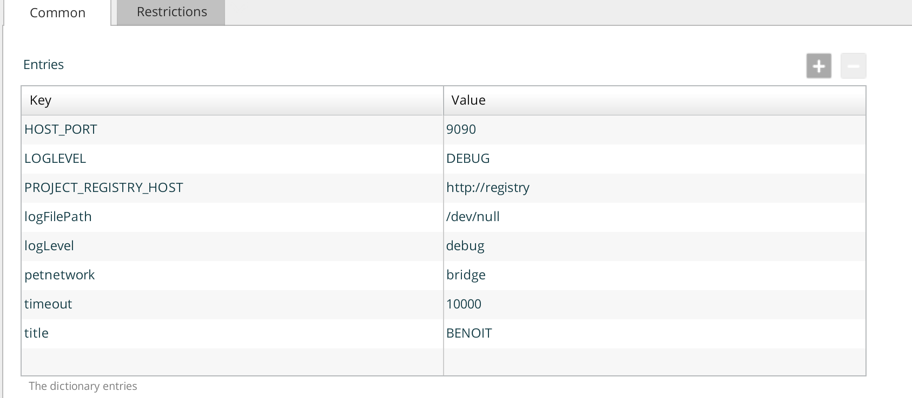

# xld-petclinic-docker
A sample Java application that shows how to package war in a tomcat docker image and deploy them with XLDeploy

## Usage
* set the `docker` environment

```
export DOCKER_TLS_VERIFY="1"
export DOCKER_HOST="tcp://192.168.99.123:2376"
export DOCKER_CERT_PATH="/Users/bmoussaud/.docker/machine/machines/docker-machine-virtualbox-1"
export DOCKER_MACHINE_NAME="docker-machine-virtualbox-1"
# Run this command to configure your shell:
# eval "$(docker-machine env docker-machine-virtualbox-1)"
```

* run `mvn clean package`

To integrate with *XL Deploy*,
* start XL Deploy version 5.0 with the xld-docker-plugin defined here: https://github.com/bmoussaud/xld-docker-plugin
* run `mvn clean install`. This command `push`the images in the registry
  using a timestamp for version and `import` the XL Deploy DAR file in XL Deploy


The XL Deploy manifest file for the application:

```
<?xml version="1.0" encoding="UTF-8"?>
<udm.DeploymentPackage version="3.0-CD-20150909-075831" application="Docker/PetDocker">
  <orchestrator>
    <value>parallel-by-deployment-group</value>
  </orchestrator>
  <deployables>
    <smoketest.HttpRequestTest name="smoke test">
      <expectedResponseText>{{title}}</expectedResponseText>
      <links>
        <value>petclinic:petclinic</value>
      </links>
      <url>http://petclinic:8080/petclinic</url>
    </smoketest.HttpRequestTest>
    <docker.Image name="petclinic">
      <ports>
        <docker.PortSpec name="petclinic/exposed-port">
          <hostPort>8888</hostPort>
          <containerPort>8080</containerPort>
        </docker.PortSpec>
      </ports>
      <registryHost>{{PROJECT_REGISTRY_HOST}}</registryHost>
      <image>petportal/petclinic:3.1-20150909055821</image>
      <links>
        <docker.LinkSpec name="petclinic/petclinic-backend">
          <alias>petclinic-backend</alias>
        </docker.LinkSpec>
      </links>
      <volumes>
        <docker.VolumeSpec name="petclinic/petclinic-config">
          <containerPath>/application/properties</containerPath>
          <hostPath>{{HOST_TARGET_PATH}}</hostPath>
        </docker.VolumeSpec>
      </volumes>
      <variables>
        <docker.EnvironmentVariableSpec name="loglevel">
          <value>{{LOGLEVEL}}</value>
        </docker.EnvironmentVariableSpec>
      </variables>
    </docker.Image>
    <docker.Image name="petclinic-backend">
      <registryHost>{{PROJECT_REGISTRY_HOST}}</registryHost>
      <image>petportal/petclinic-backend:1.1-20150909055821</image>
    </docker.Image>
    <sql.SqlScripts name="sql" file="sql/sql" />
    <docker.File name="config" file="config/petclinic.properties">
      <targetPath>{{HOST_TARGET_PATH}}/petclinic.properties</targetPath>
    </docker.File>
  </deployables>
</udm.DeploymentPackage>

```

Use the following dictionary to configure your deployed application (fake values!)

